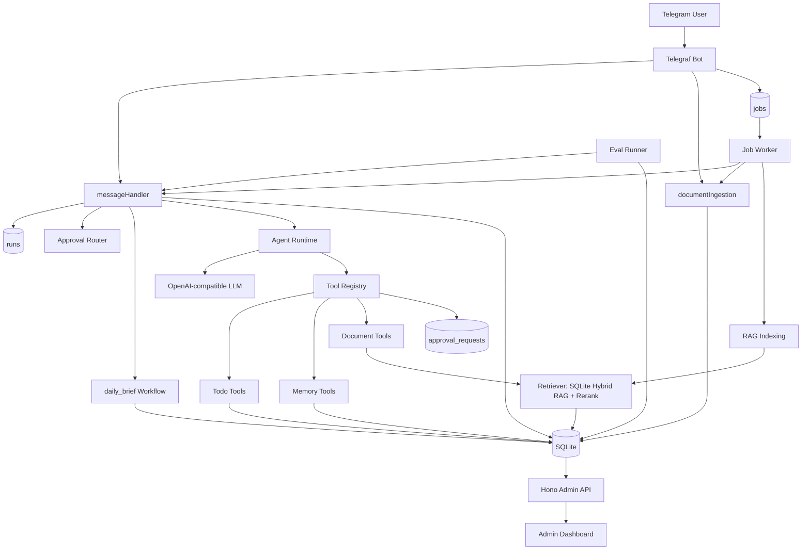

# Architecture

本文说明 Personal Agent v1.0.0 的系统结构、请求链路和关键边界。

## 系统架构图

## 核心模块

- `src/index.ts`：启动 Telegram Bot 和 Admin API。
- `src/bot/telegram.ts`：处理 Telegram `/start`、文本消息、文档上传和 progress message。
- `src/services/messageHandler.ts`：统一文本消息入口，创建 run，处理 approval 决策、workflow 路由和普通 Agent 对话。
- `src/agent/index.ts`：构造 system prompt、注入重要记忆、调用 LLM、循环执行 tool calls。
- `src/jobs/*`：SQLite job queue、同进程 worker、文本消息/文档导入/RAG 索引后台执行。
- `src/tools/registry.ts`：工具注册、OpenAI tool schema 转换、风险分级、approval request 创建、tool call 审计。
- `src/tools/*`：todo、memory、document 工具实现。
- `src/services/documentIngestion.ts`、`chunking.ts`、`ragText.ts`、`rerank.ts`：文档入库、切分、检索和本地重排。
- `src/workflows/dailyBrief.ts`：`daily_brief` 工作流编排和 step 记录。
- `src/admin/*`：Hono Admin API、鉴权、只读 Dashboard 页面。
- `src/eval/*`：eval runner、case scoring、mock/real model 执行。
- `src/db/*`：SQLite + Drizzle 数据访问层。

## 请求链路

文本消息主链路：

1. Telegram Bot 收到文本消息，发送 `正在处理...` progress message。
2. Bot 创建 `runs` 记录和 `handle_text_message` job，状态为 `pending`。
3. 同进程 Job Worker 原子领取 job，进入 `messageHandler`。
4. 如果消息是 `确认 <code>` 或 `取消`，先进入 approval 决策分支。
5. 如果消息触发 `生成今日简报`、`今日简报` 或 `daily brief`，进入 workflow 分支。
6. 其他消息进入 Agent runtime，LLM 可选择调用 tools。
7. Tool registry 校验参数、判断风险、执行工具或创建 approval request。
8. messageHandler 将 run 标记为 `succeeded` 或 `failed`，worker 将 job 标记为 `succeeded`、`failed` 或重新排队。
9. Bot 用最终回复覆盖 progress message；如果进程重启导致内存 progress 丢失，run/job 状态仍保留在 SQLite。

文档上传链路：

1. Telegram Bot 收到 document message。
2. 校验扩展名和 2MB 文件大小限制。
3. 下载文件并按 UTF-8 文本解析。
4. 创建 `ingest_document` job。
5. Worker 调用 `ingestDocument` 写入 `documents`、`document_chunks`，文档 `index_status=pending`。
6. 导入成功后创建 `index_document_chunks` job，后台生成 chunk embeddings。
7. Embedding 失败时文档 `index_status=failed`，keyword fallback 仍可检索。
8. 对重复内容按 hash 跳过导入。

## runId Trace 链路

`runId` 是一次用户请求的追踪主键：

- 文本消息进入 `messageHandler` 后立即创建 `runs.id`。
- Agent tool execution context 带上 `runId`。
- 已执行工具写入 `tool_calls.run_id`。
- 高风险工具创建 `approval_requests.run_id`。
- 用户后续确认 approval 时，新确认消息也会创建一个新的 run；真正执行的 tool call 关联确认消息的 run，并通过 `executed_tool_call_id` 反查 approval。
- `jobs.run_id` 关联后台任务和对应 run，便于查看 pending/running/failed job。
- `daily_brief` 写入 `workflows.run_id`，steps 写入 `workflow_steps.workflow_id`。
- Eval scoring 优先使用 case 对应的 `runId` 查询 tool calls、approvals 和 workflow，避免被 setup 数据污染。

Admin Dashboard 的 run detail 将 run、tool calls、approval requests、workflow、workflow steps 聚合成 trace timeline，用于复盘一次请求。

## 边界说明

### Tool Calling

- LLM 只决定是否调用工具和给出参数。
- 工具参数必须通过 Zod schema 校验。
- Tool registry 负责统一记录 `tool_calls`，并拦截高风险工具。
- 单次 Agent 对话最多 8 轮 tool calling，避免无限循环。

### Approval

- `write_high`、`external_send`、`destructive` 风险级别需要 approval。
- 未审批时不会直接执行工具，只创建 `approval_requests`。
- 所有需要 approval 的操作都会生成确认码，用户必须回复 `确认 <code>`。
- 确认时按 `user_id + chat_id + approval_code + status=pending` 精确匹配，不依赖 latest pending approval 执行。
- 状态机为 `pending -> executing -> executed/execution_failed`，取消和过期分别进入 `rejected`、`expired`。
- `取消` 会拒绝 pending approval；过期 approval 会被标记为 `expired`。
- Admin Dashboard 只读，不执行 approval。

### RAG

- 文档入库保存原文 hash、chunks、metadata，embedding 索引由 `index_document_chunks` job 后台执行。
- RAG 通过 `Retriever` 接口访问；当前实现是 `SqliteRetriever`，保留 keyword + vector hybrid score。
- Embedding 不可用、索引失败或尚未完成时 fallback 到 keyword。
- 本地 rerank 根据 title、heading、exact phrase、keyword coverage、recency 等信号调整排序。
- Agent 必须基于 `search_documents` 返回 chunks 回答；证据不足时应说明没有足够依据。

### Workflow

- Workflow 是代码编排，不由 LLM 自由规划。
- 当前只有 `daily_brief`，固定步骤为 `list_open_todos`、`load_important_memories`、`search_recent_documents`、`generate_brief`、`save_result`。
- 每个 step 都有独立状态、输入、输出和错误，便于 trace。

### Observability

- `runs` 记录用户输入、输出、状态、耗时和错误。
- `jobs` 记录后台任务类型、状态、attempts、锁、payload、错误和可重试时间。
- `tool_calls` 记录工具参数、结果、状态和耗时。
- `approval_requests` 记录风险级别、确认码、过期时间、操作摘要和执行结果。
- `workflows` / `workflow_steps` 记录 workflow 全链路。
- `eval_runs` / `eval_results` 记录回归结果和失败原因。
