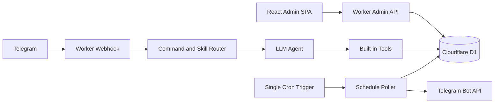

# Architecture

Personal Agent is a Cloudflare-native, single-owner Telegram agent.

## Runtime Boundaries

- `apps/worker`: Hono Worker, Telegram webhook, Admin API, auth callback, scheduled handler, D1 repositories, LLM/search/fetch clients.
- `apps/admin`: React/Vite SPA served by Worker assets. Routes under `/admin` are client-side routes.
- `packages/shared`: stable schemas, DTOs, constants, and types shared by Worker and Admin.

## Request Flow

Telegram owner messages enter `/telegram/webhook`. The Worker validates the Telegram secret, ignores non-owner updates, creates a run, then applies priority order:

1. explicit skill trigger such as `/skill <id> ...`;
2. skill trigger phrase exact or prefix match;
3. deterministic built-in commands;
4. LLM fallback.

Every run records tool calls and error summaries for Admin trace pages.

## Admin Flow

The SPA checks `/api/admin/me`. Unauthenticated users see Telegram Login. The callback verifies Telegram login hash and owner id, then issues a signed HttpOnly session cookie. All Admin data APIs require that session.

## Data Model

D1 stores runs, tool calls, todos, memories, approvals, skills, skill versions, route decisions, skill runs, schedules, schedule executions, long tasks, long task steps, and long task events. Repositories use prepared statements directly and keep D1-specific details out of shared schemas.

## Long Tasks And Schedules

Dynamic schedules are stored in D1 and executed by a single minute Cron Trigger. Schedule executions use an idempotency key on schedule id plus scheduled time.

Automatic long-task planning runs before the ordinary LLM fallback for non-command Telegram messages. Complex requests create a persisted task, planner steps, and events; the executor runs bounded steps inline and the minute Cron resumes stale running tasks. The removed workflow skill system is not part of this path.

## External Calls

LLM uses an OpenAI-compatible chat completions endpoint. Search uses Brave Search. URL fetching only accepts http/https and enforces size limits.
