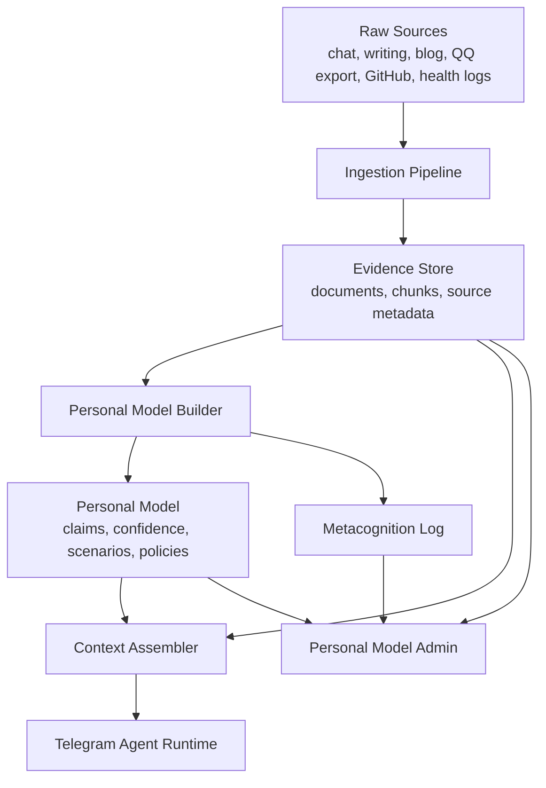

# Personal Model Implementation Plan

本文档说明如何在当前 Cloudflare Worker + D1 + React Admin 架构内实现个人理解模型。它基于 [personal-model-design.md](./personal-model-design.md) 的产品约束，重点回答实现路径、数据模型、对话链路、Admin 能力和阶段验收。

## Current Baseline

当前仓库已经具备这些基础：

- Telegram webhook 入口。
- Cloudflare Worker 作为后端运行时。
- D1 作为持久化数据库。
- React Admin SPA。
- `runs`、`tool_calls`、`todos`、`memories`、`memory_events` 等基础表。
- `save_memory`、`search_memory`、`delete_memory_request` 等基础记忆工具。
- Admin Data 页面可查看 Todos 和 Memories。

当前记忆能力仍是简单文本记忆：

- `memories.content` 保存原始文本。
- `normalized_content LIKE` 做关键词搜索。
- `memory_events` 只记录基础事件。
- Admin 对记忆是只读列表，没有置信度、证据、适用范围、禁区、版本、场景模型或元认知日志。

因此实现策略不是推倒重做，而是在现有 memories 之上新增一层结构化 personal model。

## Target Architecture

目标架构分四层：



核心原则：

- 原始资料是证据，不直接等于结论。
- 个人模型是从证据中抽取的可审计判断。
- 对话时优先检索个人模型，再按需检索原始证据。
- Admin 必须能查看、修改、降权、废弃和审计这些判断。

## Data Model

建议新增一次 D1 migration，例如 `0005_personal_model.sql`。

### `source_documents`

保存原始资料或外部资料的元数据。

关键字段：

- `id TEXT PRIMARY KEY`
- `owner_tg_user_id INTEGER NOT NULL`
- `source_type TEXT NOT NULL`
- `title TEXT`
- `uri TEXT`
- `source_created_at INTEGER`
- `source_updated_at INTEGER`
- `ingested_at INTEGER NOT NULL`
- `status TEXT NOT NULL`
- `usage_policy TEXT NOT NULL`
- `sensitivity TEXT NOT NULL`
- `metadata_json TEXT NOT NULL`

`source_type` 初始建议：

- `conversation`
- `manual_note`
- `writing`
- `blog`
- `weekly`
- `qq_export`
- `weibo_export`
- `github_personal`
- `github_work`
- `health_log`
- `relationship_note`
- `personality_framework`

`usage_policy` 初始建议：

- `default_available`
- `use_only_if_relevant`
- `use_only_if_user_mentions`
- `do_not_use`

### `source_chunks`

保存可检索片段。先支持文本检索，后续接入向量检索。

关键字段：

- `id TEXT PRIMARY KEY`
- `document_id TEXT NOT NULL`
- `owner_tg_user_id INTEGER NOT NULL`
- `chunk_index INTEGER NOT NULL`
- `content TEXT NOT NULL`
- `normalized_content TEXT NOT NULL`
- `token_count INTEGER`
- `metadata_json TEXT NOT NULL`
- `created_at INTEGER NOT NULL`

后续如果接 Cloudflare Vectorize 或外部向量库，不建议把向量直接塞进 D1；D1 保存 chunk 元数据和外部 vector id。

### `personal_model_claims`

保存 agent 对用户的结构化理解。

关键字段：

- `id TEXT PRIMARY KEY`
- `owner_tg_user_id INTEGER NOT NULL`
- `claim TEXT NOT NULL`
- `layer TEXT NOT NULL`
- `scenario TEXT NOT NULL`
- `confidence TEXT NOT NULL`
- `status TEXT NOT NULL`
- `usage_policy TEXT NOT NULL`
- `sensitivity TEXT NOT NULL`
- `valid_from INTEGER`
- `valid_until INTEGER`
- `last_confirmed_at INTEGER`
- `created_at INTEGER NOT NULL`
- `updated_at INTEGER NOT NULL`
- `metadata_json TEXT NOT NULL`

`layer` 初始建议：

- `fact`
- `preference`
- `pattern`
- `value`
- `interpretation_framework`
- `current_state`
- `positive_resource`
- `negative_pattern`
- `boundary`

`scenario` 初始建议：

- `global`
- `writing`
- `health`
- `relationship`
- `self_knowledge`
- `emotional_support`
- `work_decision`
- `technical_writing`
- `technical_collaboration`
- `life_decision`

`confidence`：

- `low`
- `medium`
- `high`

`status`：

- `active`
- `under_revision`
- `deprecated`
- `archived`
- `deleted`

### `personal_model_evidence`

连接 claim 与证据。

关键字段：

- `id TEXT PRIMARY KEY`
- `claim_id TEXT NOT NULL`
- `owner_tg_user_id INTEGER NOT NULL`
- `evidence_type TEXT NOT NULL`
- `source_document_id TEXT`
- `source_chunk_id TEXT`
- `run_id TEXT`
- `quote TEXT`
- `weight TEXT NOT NULL`
- `created_at INTEGER NOT NULL`

`evidence_type`：

- `source_chunk`
- `conversation_run`
- `manual_confirmation`
- `admin_edit`
- `framework_consistency`
- `behavioral_observation`

### `personal_model_events`

记录个人模型生命周期事件。

关键字段：

- `id TEXT PRIMARY KEY`
- `claim_id TEXT`
- `owner_tg_user_id INTEGER NOT NULL`
- `event_type TEXT NOT NULL`
- `payload_json TEXT NOT NULL`
- `created_at INTEGER NOT NULL`

`event_type`：

- `proposed`
- `created`
- `updated`
- `confirmed`
- `corrected`
- `deprecated`
- `merged`
- `conflict_detected`
- `used_in_response`
- `excluded_by_policy`

### `metacognition_logs`

保存 agent 对自身理解变化的记录。

关键字段：

- `id TEXT PRIMARY KEY`
- `owner_tg_user_id INTEGER NOT NULL`
- `run_id TEXT`
- `summary TEXT NOT NULL`
- `new_understanding_json TEXT NOT NULL`
- `corrections_json TEXT NOT NULL`
- `uncertainties_json TEXT NOT NULL`
- `risks_json TEXT NOT NULL`
- `created_at INTEGER NOT NULL`

### `understanding_gaps`

保存 agent 当前认为缺失的信息。

关键字段：

- `id TEXT PRIMARY KEY`
- `owner_tg_user_id INTEGER NOT NULL`
- `scenario TEXT NOT NULL`
- `gap TEXT NOT NULL`
- `priority TEXT NOT NULL`
- `status TEXT NOT NULL`
- `created_at INTEGER NOT NULL`
- `updated_at INTEGER NOT NULL`
- `resolved_at INTEGER`

## Runtime Flow

### 1. Pre-Response Context Assembly

在 `executeLlmAgent` 前增加一个 context assembly 步骤：

1. 判断当前消息场景：写作、关系、健康、自我认知、情绪陪伴、技术等。
2. 检索 active 的高置信和中置信 personal model claims。
3. 检索当前状态 claims，并过滤过期状态。
4. 根据场景只取最相关的少量 claim。
5. 如问题需要证据，再检索 source chunks。
6. 组装成 system/developer context，注入 LLM。

上下文注入要克制。不要把所有个人模型都塞进 prompt。

推荐注入结构：

```text
User model context:
- Stable preferences:
  - ...
- Current state:
  - ...
- Scenario-specific notes:
  - ...
- Boundaries:
  - ...

Use these implicitly. Only cite them explicitly when needed for correction, conflict, sensitive reasoning, or when the user asks why.
```

### 2. Post-Response Reflection

每轮对话结束后，异步或同步低成本执行一次轻量反思：

1. 本轮是否出现可保存的新事实、偏好、模式或修正。
2. 是否需要提出保存某条 personal model claim。
3. 是否有旧理解被用户纠正。
4. 是否新增 understanding gap。
5. 是否应该写入 metacognition log。

第一版可以先不自动调用 LLM 反思，改为显式指令：

- `记住：...` 保存普通 memory。
- `记录理解：...` 保存 personal model claim。
- `修正理解：...` 修改或废弃 claim。

等 Admin 和数据模型稳定后，再加入自动提议保存。

### 3. Evidence-Aware Response

agent 在使用个人模型时必须遵守：

- 默认隐性使用，不频繁展示“我记得你”。
- 情绪不确定时轻量判断 + 单问题校准。
- 使用旧资料挑战用户时带时间和限定。
- 关系、健康、重大生活选择中保留不确定性。
- 公司资料仅在工作场景使用，不进入人格模型。

## Admin Implementation

建议新增 Admin 一级导航：`Personal Model`。

页面结构：

- `Overview`
- `Claims`
- `Evidence`
- `Gaps`
- `Metacognition`
- `Sources`
- `Settings`

### Claims 页面

能力：

- 列表查看 claim、layer、scenario、confidence、status、updatedAt。
- 按 layer、scenario、confidence、status、usage_policy 过滤。
- 查看 claim 详情和证据链。
- 编辑 claim 文本、confidence、status、usage_policy、valid_until。
- 标记准确、部分准确、过时、错误、不再使用。
- 查看事件历史。

### Sources 页面

能力：

- 查看导入源。
- 设置 usage policy。
- 设置 source_type。
- 隐藏、排除、删除原始资料。
- 原始内容默认不可改。

### Gaps 页面

能力：

- 查看 agent 当前不确定什么。
- 标记已解决。
- 手动新增理解缺口。
- 后续可由 agent 在对话中自然追问。

### Metacognition 页面

能力：

- 查看 agent 理解变化历史。
- 查看被用户纠正过的记录。
- 查看近期哪些信息影响过回答。

## API Plan

建议新增路由前缀：

- `GET /api/admin/personal-model/claims`
- `GET /api/admin/personal-model/claims/:id`
- `POST /api/admin/personal-model/claims`
- `PATCH /api/admin/personal-model/claims/:id`
- `GET /api/admin/personal-model/claims/:id/events`
- `GET /api/admin/personal-model/sources`
- `PATCH /api/admin/personal-model/sources/:id`
- `GET /api/admin/personal-model/gaps`
- `PATCH /api/admin/personal-model/gaps/:id`
- `GET /api/admin/personal-model/metacognition`

Telegram/LLM tool 后续可增加：

- `propose_personal_claim`
- `search_personal_model`
- `correct_personal_claim`
- `add_understanding_gap`

第一版不建议让 LLM 直接删除 claim。删除和 `do_not_use` 应走 Admin 或确认流程。

## RAG Implementation Path

### V0: Structured Memory Without Vector Search

目标：先实现个人模型治理，不急着做向量库。

范围：

- 新增 personal model D1 表。
- 支持 Admin 查看和编辑 claims。
- 支持 Telegram 指令保存结构化 claim。
- 在 LLM system context 中注入少量 active claims。
- 当前 `memories` 继续保留，作为简单记忆。

验收：

- 能保存“写作默认保留表达气质”这类高置信约束。
- Admin 能查看、编辑、废弃该 claim。
- LLM 回复时能隐性遵守该约束。
- 修改 claim 后后续回复策略变化。

### V1: Source And Evidence Layer

目标：把原始资料和个人模型 claim 分开。

范围：

- 新增 `source_documents`、`source_chunks`、`personal_model_evidence`。
- 支持手动粘贴文本或 Markdown 导入。
- 支持 source usage policy。
- claim 可以关联证据。

验收：

- 一条 claim 能显示它来自哪次对话或哪份文档。
- 旧资料可标记 `use_only_if_relevant` 或 `do_not_use`。
- Admin 能看到证据链。

### V2: Metacognition And Gaps

目标：让 agent 知道自己如何理解用户，以及还不知道什么。

范围：

- 新增 metacognition log 和 understanding gaps。
- 对话后可记录理解变化。
- Admin 可查看被修正记录和缺口。
- agent 在信息不足时可自然问一个关键问题。

验收：

- 用户纠正 agent 后，后台能看到 correction event。
- agent 能在相关场景提问补齐 gap。
- 不会在简单工具任务中过度追问建模问题。

### V3: Real RAG Ingestion

目标：接入真实资料源。

优先级：

1. 当前对话与显式偏好。
2. 写作资料。
3. 关系、自我认知、情绪资料。
4. 健康作息与生活状态资料。
5. GitHub 和技术资料。
6. frontend-weekly。

初始只做文本/Markdown 导入，先不接复杂 OAuth。

验收：

- 支持导入 refined-x 文章导出的 Markdown。
- 支持导入 QQ 空间/微博手动导出文本。
- 支持为每个 source 设置 source_type 和 usage_policy。
- 检索结果可以区分“用户原创观点”和“外部收录内容”。

### V4: Vector Retrieval And Evaluation

目标：从关键词检索升级为可评估 RAG。

范围：

- chunk 策略按 source_type 区分。
- 接入向量检索服务或 Cloudflare Vectorize。
- 保留 D1 中的 chunk metadata 和 vector id。
- 建立 golden queries。
- Admin 显示 retrieval trace。

验收指标：

- personal model claims retrieval precision。
- source chunk Recall@5 / Recall@10。
- 不可回答拒答率。
- 旧资料误用率。
- 情绪误判人工评估。
- 建议适配度人工评估。

## Prompt And Policy Changes

当前 `executeLlmAgent` system prompt 只有通用 Telegram agent 规则。实现 personal model 后，应加入固定行为政策：

- 默认用简洁中文。
- 隐性使用个人模型，不频繁显性引用旧资料。
- 不确定情绪时先轻判断，再问一个校准问题。
- 当用户分析过度时，可以转向具体行动。
- 观点可以锋利，语气必须平静，态度必须温和。
- MBTI 和星盘只作为一致性校验，不覆盖现实证据。
- 公司资料与个人模型强隔离。
- 不自称宗教、心理或终极真理权威。

这些规则应来自代码内固定 system context，而不是普通 RAG 检索结果。

## Suggested First Sprint

第一轮实现不要碰向量检索。先做 personal model 的最小闭环。

建议任务：

1. 新增 `0005_personal_model.sql`。
2. 在 shared constants/schemas 中增加 claim、source、gap、metacognition 类型。
3. 在 Worker repositories 中增加 personal model CRUD。
4. 增加 Admin API：claims list/detail/create/patch。
5. 增加 Admin Personal Model Claims 页面。
6. 增加 `记录理解：...` Telegram 指令，保存 high-confidence manual claim。
7. 在 `executeLlmAgent` 前读取少量 active high-confidence claims，注入 system context。
8. 增加测试：
   - migration readiness 包含新表。
   - admin claims API 需要登录。
   - manual claim 可创建、编辑、废弃。
   - LLM prompt 会包含 active claim，不包含 deleted/do_not_use claim。

这一步完成后，系统就不再只是“保存记忆”，而是开始拥有可治理的个人理解模型。

## Risks

### Prompt Bloat

个人模型越积越多，不能全部注入。必须做场景过滤、置信度过滤和数量限制。

### Wrong Claim Persistence

错误理解一旦进入高置信模型，会长期污染回答。因此必须保留证据、事件和 Admin 修正能力。

### Sensitive Overexposure

敏感信息默认可用，但显性引用必须克制。实现上需要区分 retrieval/use 和 final wording。

### Work-Personal Leakage

公司项目资料必须独立 source_type 和 namespace。默认不得进入个人模型。

### RAG Before Governance

如果先上大规模 RAG，再补治理，会很难解释 agent 为什么这样判断。应先做结构化模型和 Admin，再扩大资料源。

## Completion Definition

个人模型目标不能只以“能保存记忆”作为完成。

阶段性完成至少需要证明：

- agent 有结构化 personal model claim，而不是只有文本 memories。
- 每条 claim 有层级、场景、置信度、状态、使用策略和证据。
- Admin 能查看和修正个人模型。
- 对话前能检索并隐性使用相关 claim。
- 对话后能记录理解变化、纠正和缺口。
- 原始资料和结论型记忆分离。
- 旧资料、敏感信息、公司资料有明确使用边界。
- 有 golden queries 或人工评估来检查情绪误判、旧资料误用和建议不适配。

